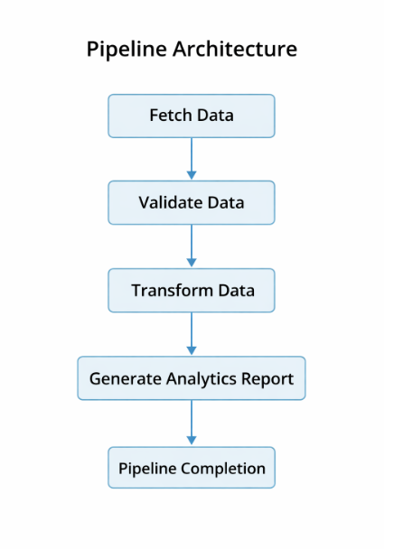
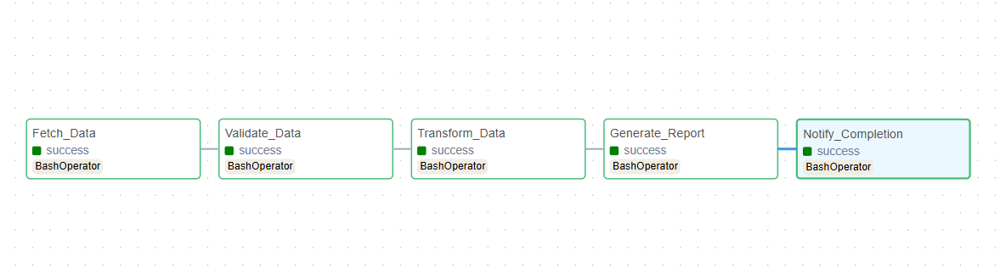

# Spotify Playlist Data Pipeline --

## Project Overview:

This project implements an automated data pipeline that processes Spotify playlist data for analysis.

The pipeline fetches playlist metadata from a public JSON dataset, performs data cleaning and transformation using Pandas, and stores the processed dataset locally for further analysis.

The workflow is automated using Apache Airflow, allowing the pipeline to run as a scheduled task instead of manual execution.

This project demonstrates fundamental data engineering concepts, including data ingestion, transformation, orchestration, and automated workflow management.

⸻

### Dataset Source

The playlist data is fetched from the following public JSON dataset:
[text](https://raw.githubusercontent.com/rushi4git/spotify-playlist-data/refs/heads/main/spotify_playlist.json)

| Column | Description |
|------|------|
| track_name | Name of the track |
| artist_name | Artist performing the track |
| album_name | Album name |
| popularity | Popularity score (0–100) |
| duration_ms | Track duration in milliseconds |
| release_date | Track release date |

### Project Objectives:

The goal of this project is to build a Python-based data pipeline that:
1.	Fetches playlist data from an external JSON file
2.	Converts the JSON dataset into a Pandas DataFrame
3.	Performs data cleaning and transformation
4.	Stores processed outputs locally
5.	Automates the workflow using Apache Airflow

### Pipeline Architecture:

#### Follows data engineering workflow-



### Airflow DAG Workflow
The pipeline is orchestrated using Apache Airflow and contains the following tasks:


| Task | Description |
|-----|-----|
| fetch_data | Downloads playlist JSON dataset |
| validate_data | Ensures dataset structure is correct |
| transform_data | Performs data transformations using Pandas |
| generate_report | Generates analytics summary |
| notify_completion | Marks pipeline completion |

This demonstrates how Airflow can automate ETL workflows

### Data Transformations:
The pipeline performs the following transformations:

1. Convert Duration to Minutes.
2. Extract Release Year.
3. Remove Duplicate Records - Duplicate tracks are removed from the dataset.
4. Handle Missing Values - Rows with missing critical fields are removed.
5. Popularity Classification - A new column popularity_category is created.


| Popularity Score | Category |
|------------------|----------|
| 0 – 40           | Low      |
| 41 – 70          | Medium   |
| 71 – 100         | High     |

### Output Files:
The pipeline generates the following outputs-

1. Raw Dataset - playlist_raw.csv
2. Transformed Dataset - playlist_transformed.csv
3. Summary Report - summary_report.txt
4. Dataset Statistics - dataset_statistics.txt

### Project Structure:

```
project_spotify/
│
├── dags/
│   └── spotify_dag.py
│
├── scripts/
│   └── main.py
│
├── output/
│   ├── playlist_raw.csv
│   ├── playlist_transformed.csv
│   ├── summary_report.txt
│   ├── dataset_statistics.txt
│   ├── duration_distribution.png
│   └── top_artists.png
│
├── docker-compose.yml
├── requirements.txt
└── README.md
```

### Technologies Used
	•	Python
	•	Pandas
	•	Requests
	•	Apache Airflow
	•	Docker

### How to Run the project
 1. Clone the repository
        git clone [text](https://github.com/noelmathias/Spotify_playlist_data_pipeline.git)  

    next, `cd Spotify_playlist_data_pipeline`


2. Start Airflow with Docker
    `docker-compose up`

3. Open Airflow UI
    open the browser and go to:
    [text]http://localhost:8081

    Login credentials-
    username: admin, 
    password: admin

4. Run the Pipeline
1. Open DAG - spotify_playlist_pipeline
2. Trigger DAG
3. Monitor Execution
        the pipeline will automatically generate the output files

5. Check Output Files
    the generated files will appear in the output/folder:
    output/  
    
    playlist_raw.csv  

    playlist_transformed.csv  

    summary_report.txt  

    dataset_statistics.txt  

    duration_distribution.png  

    top_artists.png


### Example Output

| track_name        | artist_name | popularity | duration_minutes | release_year |
|-------------------|-------------|------------|------------------|--------------|
| Blinding Lights   | The Weeknd  | 98         | 3.33             | 2020 |
| Shape of You      | Ed Sheeran  | 97         | 3.52             | 2017 |

### Learning Outcomes:

#### This project demonstrates key data engineering concepts:
1.	Building ETL pipelines
2.	Automating workflows using Airflow
3.	Data transformation using Pandas
4.	Generating analytical insights
5.	Containerized pipeline execution using Docker
